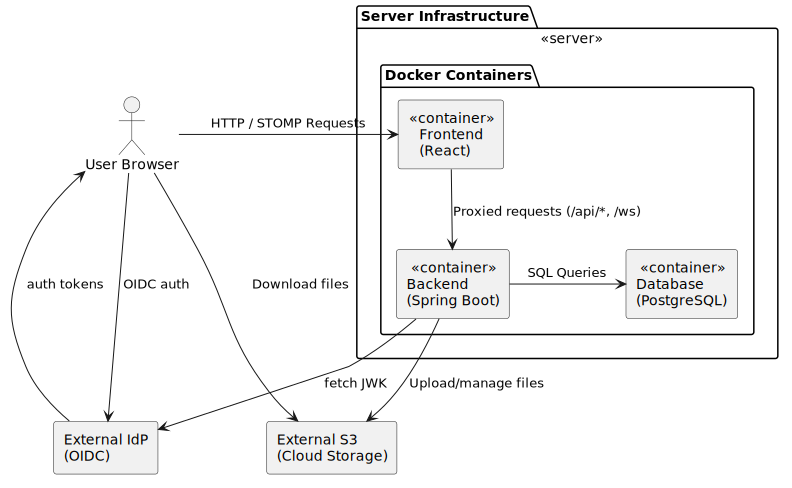

# architecture

The following diagram illustrates the architecture of the application:

The application consists of a separate backend and frontend.
The backend needs a postgreSQL database, an S3 compatible object storage, and an OpenID Connect compliant identity
provider to run. For local development, these services are run locally using docker compose.

The application uses an API-first approach. The API endpoints are defined in the `openapi.yml` file using the
OpenAPI specification. OpenAPI Generator is used to generate the API client for the frontend and the controller stubs
for the backend. The API endpoints are implemented in the backend and consumed in the frontend using the generated API
client. As there's currently no working generators for AsyncAPI with STOMP over WebSocket and Spring Boot, the
WebSocket endpoints are implemented manually in both the backend and frontend. Some of the REST models are reused,
though.

## frontend

The frontend is a React application. It is built using Vite and uses React Router for client-side routing. For
development, the frontend is served using Vite's development server. For production, the frontend is built and served
using nginx. In both development and production, the frontend server/container proxies requests to the backend
server/container for API calls / WebSocket connections.

The frontend uses ShadCN UI for components and tailwindcss for other styling. Zustand is used for state management.

## backend

The backend is a Spring Boot application. It uses Spring Data JPA for database access, Spring Security for
authentication, and Spring Web for the REST API. For the WebSocket communication, it uses Spring
WebSocket with STOMP. The backend uses Maven as build tool.

Hibernate is used as the JPA implementation, and Hibernate Envers is used for auditing. The database is
migrated using liquibase migrations created manually or using IDE plugins.

## file structure

- `backend/`: Backend application including Dockerfile.
- `frontend/`: Frontend application including nginx configuration and Dockerfile.
- `openapi.yml`: Defines the OpenAPI specification for the API endpoints, including request and response schemas.
- `docker-compose.yml`: Docker Compose configuration with required external services (database, s3, idp) for local
  development.
- `docker-compose-full.yml`: Docker Compose configuration with all services (including frontend and backend) for
  local testing of the built docker containers.
- `deploy/`: Docker Compose configuration for deployment.
- `.gitlab-ci.yml`: GitLab CI/CD pipeline configuration for building, testing, and uploading the docker images.

## deployment

The application is deployed using the docker images build from the pipeline using the docker compose configuration
in the `deploy/` directory. The application is deployed using Coolify (https://coolify.io/) which is a self-hosted
platform for deploying and managing applications.
