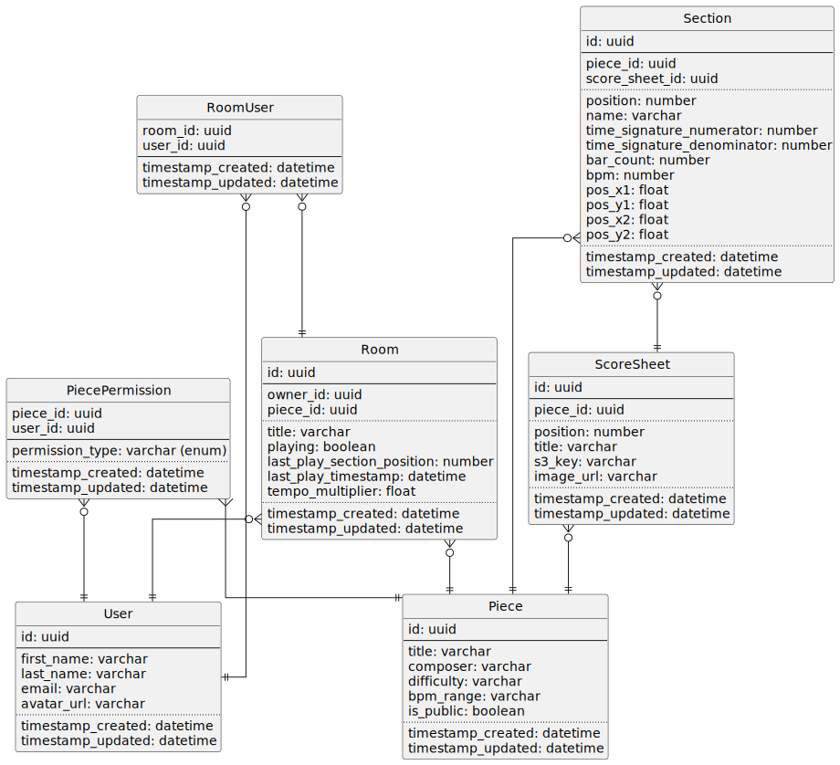

# data structure

Structured data is stored in a PostgreSQL database. The general structure is included in the following diagram.

A `piece` (Stück) is the main entity, representing a piece of music. It consists of multiple `sections` (Abschnitte),
which are ordered by their `position`. It also contains multiple `scoresheet` entries, each of which represents a
single page of the piece. Each `scoresheet` has a `position` to determine its order within the piece. Permissions for
pieces are managed through the `piece_permission` table, which links users to pieces with specific permission levels (
e.g., owner, editor, viewer).

`room` is the second major entity, representing a practice room where users can join and practice together. Each
`room` is associated with a single `piece`, which is the piece being practiced in that room. Only the room creator
can change the piece of a room and manage playback state. Currently joined users are stored in the `room_user` table.

## Audit via Hibernate Envers

Note: Audit tables and the `revinfo` table are not included in the diagram above for simplicity.

The `revinfo` table is used by the Hibernate Envers library to track entity revisions. It contains metadata about each
revision, such as the revision number, timestamp, and the user who made the change. Each entity marked with `@Audited`
will have its changes tracked in a corresponding audit table (`<table>_AUD`).

The `revinfo` entity is implemented by the `AuditRevisionEntry` class, which is annotated with `@RevisionEntity`.

The `AuditRevisionListener` class implements the `RevisionListener` interface and is responsible for populating the
`revinfo` table with relevant information during each revision.

The audit data is currently only used for restoring previous versions of pieces in `PieceHistoryService`.

Docs: https://docs.hibernate.org/orm/current/userguide/html_single/#envers-basics
