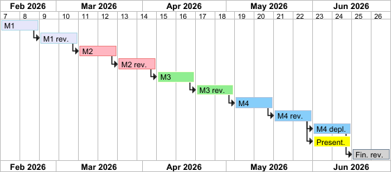

# Project Planning and Journal

## Project journal

- 2026-02-09: Initial project planning. Repo created, requirements and project overview documents created.

## Project milestones

### Milestone 1

- Requirements gathering and analysis
- Basic communication protocol design
- Basic architecture/technology overview
- Basic UI design (wireframes/mockups)
- Initial project setup (repo)

### Milestone 2

- Detailed communication protocol design
- Frontend and backend setup
- Login/authentication implementation
- Chat implementation

### Milestone 3

- State management and synchronization implementation
- Simple logic working (e.g. upload and page turning)

### Milestone 4

- Feature-complete implementation
- Requirements verification and testing

### Presentation

- Prepare presentation slides
- Prepare demo of the application
- Contents:
  - Rules and behavior of the application
  - Architecture
  - Technologies used
  - Interesting code snippets
  - Challenges and solutions
  - Conclusion

### Final revision

- Finalize documentation
- Finalize installation and usage instructions
