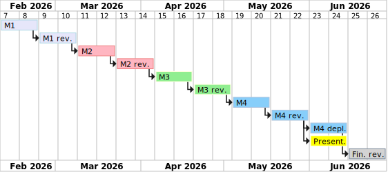

# project planning and journal

## Project journal

- 2026-02-09: Initial project planning. Repo created, requirements and project overview documents created.
- 2026-02-13: Update requirements, add use-case diagrams, add basic communication protocol, add database diagram.
- 2026-02-22: Update requirements, update communication protocol, add data structure, add mockups.
- 2026-02-09 - 2026-02-22: Preparations for milestone 2
  - Setup basic frontend project with React, TypeScript, React Router, Shadcn UI, Tailwind CSS
  - Setup basic backend project with Spring Boot, Java, PostgreSQL
  - Setup OpenAPI generator to generate API client and server stubs
  - Implement login/authentication
- 2026-03-08:
  - Finish STOMP communication basic implementation.
  - Create database models
  - Add persistence helpers: Repositories & Mappers
  - User service: Store user information in database
  - Backend: Add basic implementation for synchronous room endpoints, add dummy chat implementation
- 2026-03-09:
  - Basic room page with chat UI implemented. Basic chat functionality working.
  - Better exception handling for REST endpoints.
  - Add create room dialog.
- 2026-03-15 - 2026-03-16:
  - Added installation/setup instructions.
  - Added toasts for user feedback on error/success.
  - Added DTOs for asynchronous communication.
  - Added STOMP debug page to send test messages.
  - Improved error handling and WebSocket connection user feedback.
  - Add update room dialog.
- 2026-03-21 - 2026-03-22:
  - Implemented room deletion
  - Added breadcrumbs and page titles
- 2026-03-31 - 2026-04-02:
  - Basic piece features (CRUD) implemented.
  - Sheet upload using S3 implemented. (Bug: PDF conversion only working for image-based PDFs)
  - Add sheet music update/delete and event handling
  - Add sections add/update/delete handling (without coordinate mapping)
- 2026-04-07:
  - Add permission management for pieces
  - Add authorization to async piece topic
  - Store and list connected room users
  - Load piece on room page load and on piece update
- 2026-04-18 - 2026-04-19:
  - Create home page with list of rooms and pieces
  - Multiple bug fixes
  - Some code cleanup
  - Implemented playback state synchronization with basic section-based page turning
  - Added specific user-targeted events for piece availability
  - Allow reordering sections
  - Add section name
  - Allow editing section coordinates and display the current section on the room page
  - Added audio metronome implementation with Web Audio API.
  - Added automatic metronome playback and section progression based on timings.
- 2026-04-20 - 2026-04-21:
  - Fixed bugs:
    - Metronome not working because AudioContext not resumed
    - 401 error on session expiration
  - Automatically end audio playback
  - Tempo multiplier implementation
  - Added dedicated scoresheet edit mode
  - Improved toast persistence
  - Code cleanup and some refactoring
  - Added single-user player to piece page
- 2026-04-24 - 2026-04-26:
  - Player: Move tempo multiplier into popover menu
  - Player: Add back to beginning button
  - Player: Add keyboard controls
  - UI improvements
  - Added simple testing setup for frontend and backend
- 2026-05-02 - 2026-05-03:
  - Added a section progress indicator bar
  - Added a visual metronome
  - Added proper error pages
  - Added auditing
  - Multiple UI improvements:
    - Deletion of objects now shows a popover directly at the button location instead of a toast.
    - Less scrollbars
    - More compact piece metadata card
  - Some code cleanup
- 2026-05-10 - 2026-05-11:
  - Added history/revert feature for pieces
  - Added preview of piece history
  - Code cleanup
  - Updated documentation
  - Added full-screen view for room viewer
- 2026-05-16:
  - Added clearer error message if file upload size limit is exceeded.
  - Update documentation
- 2026-05-17:
  - Fixed small issues with responsiveness and mobile UI
  - Added PWA manifest

### Bigger pain points

- Authentication for STOMP connections: The STOMP protocol does not provide a built-in way to handle authentication
  and authorization. I had to implement a custom solution to authenticate users when they establish a WebSocket
  connection and to check their permissions for each subscription. This was a bit tricky and required some
  workarounds, especially for handling permission changes while a user is connected.
- Responsiveness of the player: Because sheet dimensions are unknown and can very, fitting the overlays over the
  sheets and making sure everything is properly aligned and responsive was a bit tricky. I tried using a CSS only
  solution for this, but it was not working reliably, so I had to use JavaScript to calculate the positions and
  sizes of the overlay based on the dimensions of the sheet.

## Project milestones

### Milestone 1

- Requirements gathering and analysis
- Basic communication protocol design
- Basic architecture/technology overview
- Basic UI design (wireframes/mockups)
- Initial project setup (repo)

### Milestone 2

- Detailed communication protocol design
- Frontend and backend setup
- Login/authentication implementation
- Chat implementation

### Milestone 3

- State management and synchronization implementation
- Simple logic working (e.g. upload and page turning)

### Milestone 4

- Feature-complete implementation
- Requirements verification and testing

### Presentation

- Prepare presentation slides
- Prepare demo of the application
- Contents:
  - Rules and behavior of the application
  - Architecture
  - Technologies used
  - Interesting code snippets
  - Challenges and solutions
  - Conclusion

### Final revision

- Finalize documentation
- Finalize installation and usage instructions
