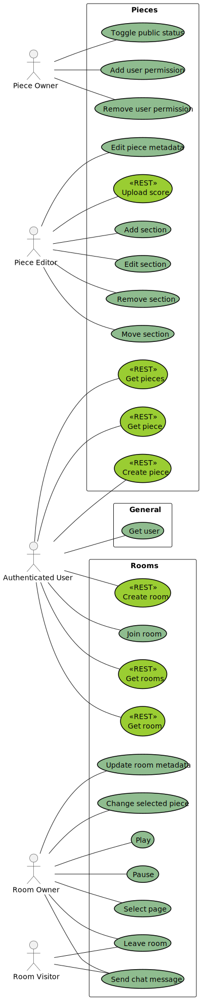

# sheetmusic-learner requirements

The following use-case diagram provides a general overview of the main features and interactions in the
sheetmusic-learner application:

This diagram only contains the required features. The features included in the use-cases are integrated in the following
requirements and are not listed separately to avoid redundancy.

## Requirements grouped by category

- Pieces
    - [FR-01 — Piece list and details](#fr-01--piece-list-and-details)
    - [FR-02 — Create piece](#fr-02--create-piece)
    - [FR-03 — Upload score](#fr-03--upload-score)
    - [FR-04 — Edit piece](#fr-04--edit-piece)
    - [FR-05 — Access control (ACL)](#fr-05--piece-access-control-acl)
    - [FR-06 — Manage sections](#fr-06--manage-sections)
    - [FR-07 — Time signature and tempo information](#fr-07--time-signature-and-tempo-information)
  - [FR-08 — Realtime collaborative editing](#fr-08--realtime-collaborative-editing)
    - [OFR-02 — Staff management](#ofr-02--staff-management)
    - [OFR-03 — Edit score](#ofr-03--edit-score)
    - [OFR-04 — Repeat sections](#ofr-04--repeat-sections)
- Player
    - [FR-09 — Page navigation](#fr-09--page-navigation)
    - [FR-10 — Playback with tempo multiplier](#fr-10--playback-with-tempo-multiplier)
    - [FR-11 — Visual cursor](#fr-11--visual-cursor)
    - [OFR-05 — Staff view](#ofr-05--staff-view)
    - [OFR-06 — Visual metronome](#ofr-06--visual-metronome)
    - [OFR-07 — Audio metronome](#ofr-07--audio-metronome)
    - [OFR-08 — Full-screen view](#ofr-08--full-screen-view)
- Rooms
    - [FR-12 — Create room](#fr-12--create-room)
    - [FR-13 — Share piece to room](#fr-13--share-piece-to-room)
    - [FR-14 — List, join and leave rooms](#fr-14--list-join-and-leave-rooms)
    - [FR-15 — Room chat](#fr-15--room-chat)
    - [FR-16 — Owner control & sync](#fr-16--owner-control--sync)
    - [OFR-01 — Change room visibility](#ofr-01--change-room-visibility)
- General/Other
    - [FR-17 — OAuth sign-in](#fr-17--oauth-sign-in)
    - [NFR-01 — File storage](#nfr-01--file-store)
    - [NFR-02 — Data storage](#nfr-02--data-store)
    - [NFR-03 — Realtime communication](#nfr-03--realtime-communication)
    - [NFR-04 — Responsive design](#nfr-04--responsive-design)
    - [NFR-05 — Audit-Logging](#nfr-05--audit-logging)
    - [ONFR-01 — User avatars via Gravatar](#onfr-01--user-avatars-via-gravatar)
- Qualitative requirements (QR)
    - [QR-01 — Maintainability: No redundancy](#qr-01--maintainability-no-redundancy)
    - [QR-02 — Maintainability: Project structure](#qr-02--maintainability-project-structure)
    - [QR-03 — Testability: Loose coupling](#qr-03--testability-loose-coupling)

## Mandatory Requirements

### Functional requirements (FR)

#### FR-01 — Piece list and details

Categories: Piece-management

A user can see a list of all pieces they have access to, with details such as title, composer and owner. A user can also
view the details of a specific piece, including its title, composer, owner and associated scores.

#### FR-02 — Create piece

Categories: Piece-management

A signed-in user can create a piece by providing a title and composer. The piece is stored on the server and can be
managed by the user. By default, the piece is private and only visible to the owner.

#### FR-03 — Upload score

Categories: Piece-management

A signed-in user can upload sheet music scores for a piece as a PDF. The score is uploaded to the server and stored for
later download. The score is associated with the piece and inherits its visibility and permissions.

#### FR-04 — Edit piece

Categories: Piece-management

The owner of a piece can edit the piece's metadata, including e.g. title and composer.

#### FR-05 — Piece access control (ACL)

Categories: Piece-management / Auth

The owner of a piece can define which users can view and edit the piece (Access Control List). The owner can also make
the piece public, which allows any authenticated user to view it.

#### FR-06 — Manage sections

Categories: Piece-management

An authorized user can define sections of a score, which are specific ranges of measures. Sections can be named (e.g.
"Chorus", "Verse", "Bridge"). Sections are associated with a specific score page and can be used for navigation and
playback.

#### FR-07 — Time signature and tempo information

Categories: Piece-management

An authorized user can add time signature and tempo information to a score and sections.

#### FR-08 — Realtime collaborative editing

Categories: Piece-management

Changes made to a piece are immediately visible to other users viewing a piece.

#### FR-09 — Page navigation

Categories: Player

An authorized user can view scores page by page and navigate between pages.

#### FR-10 — Playback with tempo multiplier

Categories: Player

An authorized user can "play" a piece with a selected tempo multiplier, which starts displaying the current position in
the piece and automatically turns pages.

#### FR-11 — Visual cursor

Categories: Player

The player can enable a visual cursor that shows the current position in the score.

#### FR-12 — Create room

Categories: Rooms

A user can create rooms with public visibility.

#### FR-13 — Share piece to room

Categories: Rooms

The owner of a room can select a piece they have access to. The piece is shared with the room even if other visitors
wouldn't have direct access to the piece otherwise.

#### FR-14 — List, join and leave rooms

Categories: Rooms

Any user can join and leave a room. All currently available rooms are displayed and immediately updated when new rooms
are created or deleted.

#### FR-15 — Room chat

Categories: Rooms

Players in the same room can chat with each other.

#### FR-16 — Owner control & sync

Categories: Rooms

The owner can navigate the selected score or start automatic playback. The current position in the score is synchronized
for all users in the same room.

#### FR-17 — OAuth sign-in

Categories: Auth

A user can sign in using OAuth2/OIDC using a predefined external IdP.

### Non-functional requirements (NFR)

#### NFR-01 — File store

Categories: Data

Uploaded files are stored in an S3-compatible bucket.

#### NFR-02 — Data store

Categories: Data

Data about pieces, rooms and users is stored in a relational database (PostgreSQL).

#### NFR-03 — Realtime communication

Categories: Communication

The frontend and backend communicate in real-time using STOMP over WebSockets.

#### NFR-04 — Responsive design

Categories: UI

The frontend should be responsive and work well on different screen sizes, including mobile devices.

#### NFR-05 — Audit-Logging

Categories: Other

All user actions are logged on the server.

## Optional requirements

### Optional functional requirements (OFR)

#### OFR-01 — Change room visibility

Categories: Rooms

A user can select and change the visibility and access restriction of a room.

#### OFR-02 — Staff management

Categories: Piece-management

Separate staffs of a score (on the same sheet) can be separately managed. For example, a score with a voice and a piano
staff can be displayed with only the voice staff, only the piano staff or both staffs. All section should contain a
subset of staffs.

#### OFR-03 — Edit score

Categories: Piece-management

The owner of a score can replace the uploaded PDF with a new version.

#### OFR-04 — Repeat sections

Categories: Piece-management

An authorized user can mark sections of a score as repeat sections, which are repeated a specified number of times
during playback.

#### OFR-05 — Staff view

Categories: Player

Every user can select the staff(s) they want to see for a specific piece. The selected staffs are stored in the user's
preferences and applied whenever the user views that piece.

#### OFR-06 — Visual metronome

Categories: Player

The user can enable a visual metronome that shows the current beat and tempo.

#### OFR-07 — Audio metronome

Categories: Player

The user can enable an audio metronome that plays a click sound on the current beat.

#### OFR-08 — Full-screen view

Categories: Player

The user can optionally display the player in full-screen mode.

### Optional non-functional requirements (ONFR)

#### ONFR-01 — User avatars via Gravatar

Categories: UI

Users see avatars of other users in the same room. The avatars are provided by Gravatar based on the users' email
addresses.

## Qualitative requirements (QR)

#### QR-01 — Maintainability: No redundancy

Categories: Maintainability

Code, especially models used in communication, should be duplicated as little as possible. To help with this, tools like
OpenAPI generator shall be used, so models can be reused for frontend and backend without defining them twice.

#### QR-02 — Maintainability: Project structure

Categories: Maintainability

The project should be organized in a way that matches the typical and/or recommended structure for the used tools.

#### QR-03 — Testability: Loose coupling

Categories: Testability

Code should be written with testability in mind, reducing coupling as much as possible.

## Dictionary

| DE       | EN          | Description                                               |
|----------|-------------|-----------------------------------------------------------|
| Stück    | Piece       | A piece of musical work.                                  |
| Partitur | Score       | The sheet music of a piece.                               |
| Zeile    | Staff/Stave | A single instrument's part in a score (en: [1] / de: [2]) |
| Raum     | Room        | A virtual place where collaborative learning happens.     |

[1]: https://en.wikipedia.org/wiki/Staff_(music)#Ensemble_staves

[2]: https://de.wikipedia.org/wiki/Notensystem_(Musik)
